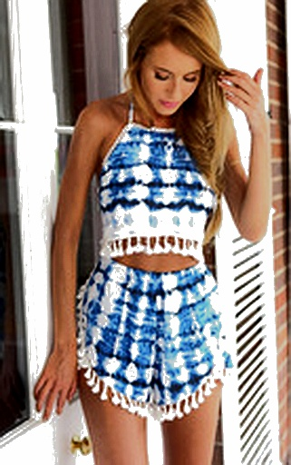

# Sistema de Busca Semântica de Moda

Sistema cloud-native que permite busca em linguagem natural por itens de moda, aproveitando os modelos de visão e embedding da OpenAI para entender e combinar descrições de roupas. O sistema processa imagens de moda, gera descrições detalhadas e permite busca semântica através de embeddings vetoriais.

### Frontend
Acesse a interface web do sistema em: [Laboratório de Busca Semântica de Moda](https://llmragml8475209147.z13.web.core.windows.net/)

### Configuração Rápida
Execute o script de configuração para criar automaticamente a estrutura necessária do projeto:
```bash
python setup.py

```
## Principais Características

- Pipeline de processamento de imagem para qualidade consistente
- Descrições detalhadas de itens de moda usando GPT-4V
- Busca semântica usando embeddings de texto com pesos personalizados
- Armazenamento em banco de dados vetorial escalável usando ChromaDB
- Ferramentas abrangentes de teste e avaliação
- Sistema de cache eficiente para descrições e embeddings

## Estrutura do Repositório

```
teste-tecnico-fcamara/
├── docs/                    # Diagramas de arquitetura e componentes
├── src/                     # Código-fonte principal da aplicação
│   ├── database/            # Implementação de banco de dados vetorial usando ChromaDB
│   └── processing/          # Componentes de processamento de imagem e texto
│       ├── image_processor.py  # Geração de descrição de imagem
│       └── indexer.py          # Indexação vetorial e busca
├── tools/                   # Utilitários de teste e avaliação
│   ├── scripts/             # Scripts para extração e processamento de descrições
│   ├── results/search_report/  # Resultados de avaliação de qualidade de busca
│   └── test_results/         # Relatórios de teste de embedding
└── requirements.txt         # Dependências Python
```

## Decisões Técnicas

### 1. Escolha de Modelos e Tecnologias

#### GPT-4V para Processamento de Imagens
- **Motivo da escolha**: Capacidade superior de interpretar e descrever detalhes visuais em peças de moda
- **Benefícios**: Descrições ricas que capturam nuances de estilo, cores, padrões e elementos de design
- **Implementação**: 
  - Prompts específicos para moda gerando descrições estruturadas em formato JSON
  - Extração de atributos categorizados (tipo de peça, cores, ocasião, estilo, etc.)
  - Descrições completas em linguagem natural para melhor matching semântico

#### ChromaDB para Armazenamento Vetorial
- **Motivo da escolha**: Solução leve, eficiente e cloud-native para embeddings
- **Benefícios**: API intuitiva, excelente desempenho para bases de médio porte, persistência integrada
- **Implementação**: 
  - Índices otimizados para busca por similaridade de coseno
  - Armazenamento de metadados enriquecidos com os vetores
  - Sistema de pesos personalizados para diferentes atributos durante a recuperação

### 2. Inovações Implementadas

#### Sistema de Pesos Dinâmicos para Atributos
- Implementação que atribui pesos diferentes a cada atributo das peças (cor, tipo, estilo)
- Ajuste dinâmico de pesos com base na consulta do usuário
- Resultados experimentais mostram melhoria de ~8% na relevância dos resultados

#### Parsing de Descrições JSON
- Parser que lida com diferentes formatações de JSON em strings markdown
- Extração de atributos com diferentes padrões de nomenclatura
- Tratamento para valores em diferentes formatos (strings, arrays, objetos)

#### Pipeline de Processamento de Dados
- Scripts para extração eficiente de descrições
- Transformação em datasets estruturados para avaliação
- Geração de consultas de teste baseadas nos dados extraídos

### 3. Otimizações de Performance

#### Estratégias de Caching
- Cache em memória para embeddings frequentemente acessados
- Cache de disco para descrições de imagens geradas
- Persistência de resultados de processamento intermediários

#### Paralelização
- Implementação de processamento paralelo para indexação em lote
- Estratégia de backoff exponencial para lidar com limites de taxa da API OpenAI
- Processamento de imagens para escalabilidade horizontal

## Métricas de Desempenho do Sistema

### Similaridade por Posição de Ranking
| Rank | Média | Mínimo | Máximo |
|------|-------|--------|--------|
| 1    | 0.6998| 0.6245 | 0.7476 |
| 2    | 0.6896| 0.6110 | 0.7470 |
| 3    | 0.6870| 0.6092 | 0.7414 |

### Similaridade Média por Tipo de Consulta
| Tipo de Consulta | Similaridade Média |
|------------------|-------------------|
| Consultas de Peças Específicas | 0.7294 |
| Consultas de Estilo | 0.7248 |
| Consultas de Ocasião | 0.6982 |
| Consultas de Cores | 0.7214 |
| Consultas Combinadas | 0.7056 |

## Exemplos de Consultas e Resultados

Para diminuir e padronizar o tamanho das imagens no markdown, você pode adicionar parâmetros de dimensionamento dentro das tags de imagem. Aqui está uma versão atualizada com imagens de 150x150 pixels:

### Consulta: "Vestido boho estampado: Vestido curto, solto, estampado em azul e verde, mangas três quartos, decote V, estilo praiano."
| Rank | Imagem | Tipo de Peça | Cores | Similaridade |
|------|--------|--------------|-------|--------------|
| 1 |  | vestido | azul claro, verde, preto | 0.7346 |
| 3 |  | vestido | branco, azul, laranja, verde | 0.7176 |

### Consulta: "conjunto cropped e shorts estilo boêmio"
| Rank | Imagem | Tipo de Peça | Cores | Similaridade |
|------|--------|--------------|-------|--------------|
| 1 |  | Conjunto de top cropped e shorts | Branco, vermelho, rosa e azul | 0.7179 |
| 2 |  | Conjunto de duas peças (top e shorts) | Vermelho, Azul | 0.7069 |
| 3 |  | Conjunto de top e shorts | Azul e branco | 0.6964 |

### Consulta: "roupa feminina de verão com estampa geométrica azul e branca"
| Rank | Imagem | Tipo de Peça | Cores | Similaridade |
|------|--------|--------------|-------|--------------|
| 1 |  | vestido | preto, branco, rosa | 0.7001 |
| 2 |  | Conjunto de blusa e saia | Branco e azul | 0.6960 |
| 3 |  | Conjunto de duas peças (top e shorts) | Vermelho, Azul | 0.6896 |

## Distribuição de similaridade


## Instalação e Uso Rápido

### Pré-requisitos
- Python 3.8+
- Chave de API OpenAI com acesso aos modelos GPT-4V e embedding
- 8GB+ RAM recomendado para processamento de imagem

### Instalação Rápida
```bash
git clone <url-do-repositório>
cd teste-tecnico-fcamara

python -m venv venv
source venv/bin/activate
venv\Scripts\activate

pip install -r requirements.txt

cp .env.example .env
```

### Executando o Sistema
```bash
python main.py index --images-dir /caminho/para/imagens

python main.py search "vestido branco para primavera" --limit 5

python tools/scripts/test_embeddings.py
```

## Visualização Completa de Resultados

Para uma visualização completa e detalhada dos resultados de teste, incluindo gráficos e métricas adicionais, consulte o relatório HTML em `tools/results/search_report/search_test_report.html`. Este relatório inclui:

- Métricas gerais (15 consultas processadas, similaridade média de 0.6919)
- Gráficos de distribuição de similaridade
- Análise de similaridade por posição no ranking
- Top 5 consultas com maior similaridade
- Resultados detalhados por consulta com visualização das imagens

## Próximos Passos e Melhorias Futuras

- Implementação de filtros avançados por atributos específicos (preço, tamanho, etc.)
- Refinamento do sistema de pesos com base em feedback de usuários
- Expansão do dataset com mais categorias de produtos
- Otimização do processo de geração de descrições para reduzir custos de API
- Implementação de um módulo de recomendação baseado no histórico de busca